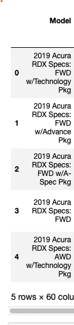

# New/Used 2019 Car Prices - (ETL) Extract, Transform, Load 

### Group Members - Richard Kim, Kai Murata

## Objective: Each member of our project collected two data sources of new and used car sales from the year 2019. We then follow the process of extracting, transforming, and loading our data frames into a database for further analysis.

--------------------------------------------------------------------------------------------------------------
## Sources: 

We collected two datasets from Kaggle that provides details for new and used car sales from the year 2019. Filtering out car sales and their models is the primary goal. 

The type of final production the databases are loaded into is relational.

    * https://www.kaggle.com/datasets/prassanth/new-cars-price-2019?select=New_cars_price.csv
    * https://www.kaggle.com/datasets/tsaustin/us-used-car-sales-data?resource=download

--------------------------------------------------------------------------------------------------------------

Begin the extraction process by importing our dependencies, used cars, and new cars csv files into pandas. Convert them into readable dataframes. We then follow our extraction process by transforming and organizing our columns from both dataframes into the desired format that lists out new columns named "Make, Model, Model_Year, Model_Details and Used/New." 

End the ETL process by loading the used car sales and new car sales dataframes from jupyter notebook into a local database that is sql compatible (ie Postgresql or MongoDB). We selected Postgresql due to the dataframes being relational and majority of transformation being completed in jupyter notebook. Convert those dataframes into a brand new database named "used_cars" and "new_cars" respectively. End the process by reconfirming that your databases have been created.

--------------------------------------------------------------------------------------------------------------
Process:
1.) Extract (import all dependencies)

    1. import 'used_car_sales.csv' from the Resources folder

    2. read the csv into a dataframe and then print

    3. repeat the steps above using 'New_cars_price.csv'

2.) Transform

### new cars
1. Due to the new cars dataframe identifying the make, model and year in a single column, we had to split the string into new columns

     [New Columns](images/2.png) 
     
2. create new dataframe with new cars with columns we needed 

### used cars
1. identify and create a new dataframe with only the 2019 used car sales price
                [Filter by 2019](images/3.png)

2. create new dataframe with new cars with columns we needed

### formatting df
1. create formatting function which formats price columns of both df to add dollars signs and 2 decimal points. remove commas

    1a. the new cars df 'msrp' column is a string, therefore remove any non-integer values, convert to float, apply our formmating function

2. be sure to drop the null values

3. set up dataframes 

        3a. rename column names that have corresponding names

        3b. sort values by make, model, model_year and ascending, ascending and descending order respectivley  

        3c. convert make and model columns to uppercase 
        
        3d. add a new column named used/new and fill in respective df

        3e. print to check

3.) Load

1. connect to local database

2. convert the dataframes into a compatible database

3. reconfirm that the databases have been made

Conclusions: this was fun
