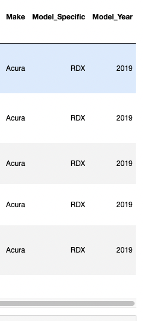
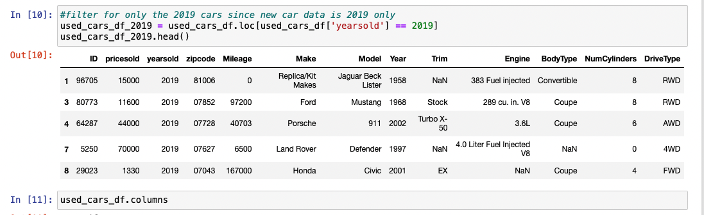

# (ETL) Extract, Transform, Load - New/Used 2019 Car Prices

#### Group Members - Richard Kim, Kai Murata

## Objective: 
Each member of our project collected two data sources of new and used car sales from the year 2019. We then follow the process of extracting, transforming, and loading our data frames into a database for further analysis.

## Sources: 

We collected two datasets from Kaggle that provides details for new and used car sales from the year 2019. Filtering out car sales and their models is the primary goal. 

The type of final production the databases are loaded into is relational.

https://www.kaggle.com/datasets/prassanth/new-cars-price-2019?select=New_cars_price.csv
https://www.kaggle.com/datasets/tsaustin/us-used-car-sales-data?resource=download

## Project Summary:

Begin the extraction process by importing our dependencies, used cars, and new cars csv files into pandas. Convert them into readable dataframes. We then follow our extraction process by transforming and organizing our columns from both dataframes into the desired format that lists out new columns named "Make, Model, Model_Year, Model_Details and Used/New." 

End the ETL process by loading the used car sales and new car sales dataframes from jupyter notebook into a local database that is sql compatible (ie Postgresql or MongoDB). We selected Postgresql due to the dataframes being relational and majority of transformation being completed in jupyter notebook. Convert those dataframes into a brand new database named "used_cars" and "new_cars" respectively. End the process by reconfirming that your databases have been created.

## Instructions:

1. Install pandas and sqlalchemy into your computer

2. Go to Kaggle websites listed above in Sources

3. Create a folder titled 'Resources' and copy the two csv files

4. Open Data_ETL using jupyter notebook after activating environment

5. Open Postgresql

6. Enter username and password in line 20

7. Run all kernals in jupyter notebook

## ETL Process:

### Extract (Import all dependencies)

1. Import 'used_car_sales.csv' from the Resources folder

2. Read the csv into a dataframe and then print

3. Repeat the steps above using 'New_cars_price.csv'

### Transform

#### New Cars
1. Due to the new cars dataframe identifying the **make**, __model__ and **year** in a single column, we had to split the string into new columns

     
    This is the original column            
     
    These are the newly created columns
     
2. Create new dataframe with new cars with columns we needed 

#### Used Cars
1. Identify and create a new dataframe with only the 2019 used car sales price
                

2. Create new dataframe with new cars with columns we need

#### Formatting Dataframes
1. Create formatting function which formats price columns of both df to add dollars signs and 2 decimal points. Remove commas

    1a. The new cars df 'MSRP' column is a string, therefore remove any non-integer values, convert to **float**. Apply our formmating function

2. Be sure to drop the null values

3. Set up the dataframes 

    3a. Rename column names that have corresponding names

    3b. Sort values by Make, Model, Model_Year and ascending, ascending and descending order respectivley  

    3c. Convert make and model columns to uppercase 
        
    3d. Add a new column named 'Used/New' and fill in respective dataframe

    3e. Print to check

### Load

1. Connect to local a database

2. Convert the dataframes into a compatible database

3. Reconfirm that the databases have been made

-------------------------------------------------------------------------------------------------------------------------------

© 2022 Richard Kim Kai Murata Project, a Georgia Tech Bootcamp project, All Rights Reserved
